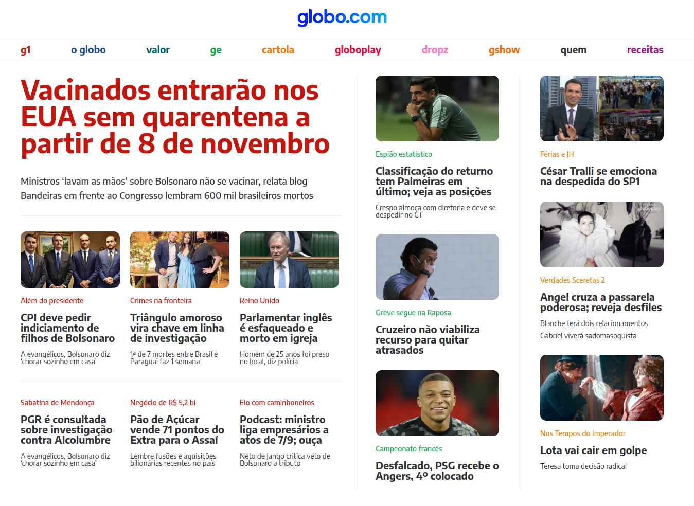

  

 
  
- Criação da página principal do Globo.com de forma estática.
   
- Responsividade para todos os tamanhos de telas

# Tópicos explorados

- Flex-box
- Media Queries

# Tecnologias 
- 
- 
- 
- 
- 

# Preview

  
   
   
  
Clique na imagem para acessar a página

 
